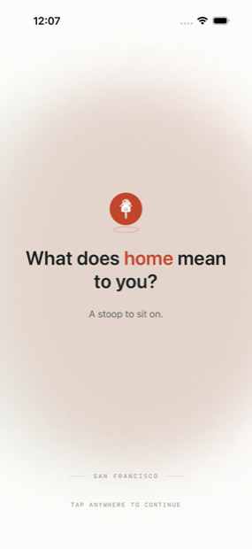
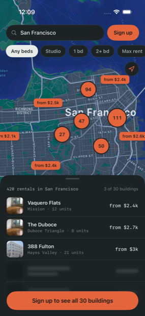
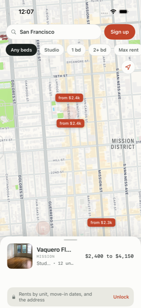
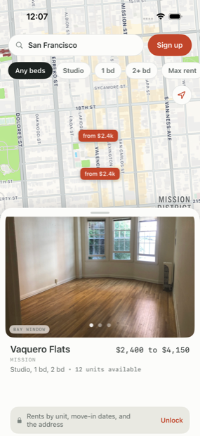
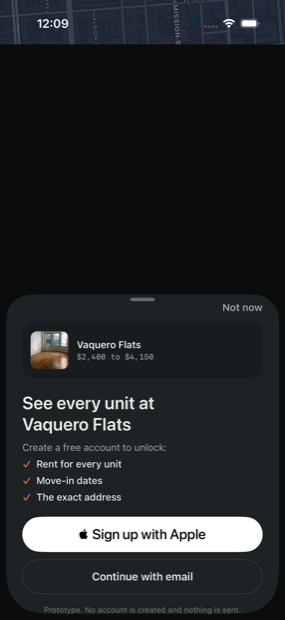
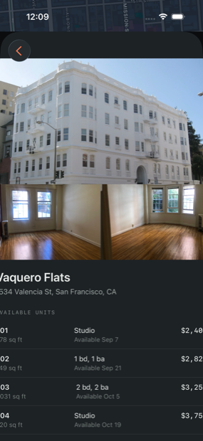
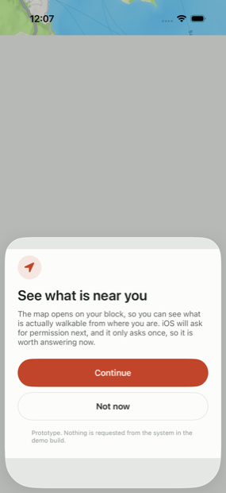
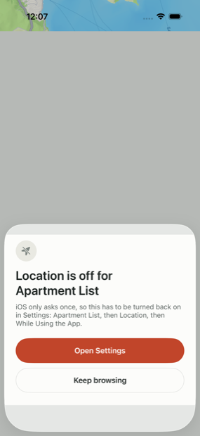
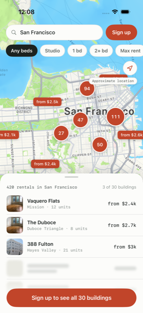

# Apartment List — logged-out map browse

A native iOS prototype of a map-first browse experience for anonymous renters in
San Francisco, with a hard signup gate. `SPEC.md` is the behavioural contract;
this file is how to build it and why it is shaped the way it is.

## Build

No Xcode project is checked in. It is generated, so the source of truth stays
reviewable as text. Everything goes through the Makefile:

```sh
brew install xcodegen
make build        # generate the project and build the app
make test         # 37 unit tests across ALCore, ALMapFeature, ALLocation
make uitest       # 5 presentation tests, on their own simulator
make run          # boot the simulator, install, and launch
make screenshot   # writes shot.png
```

`make uitest` is deliberately paranoid, because three separate things made a
naive UI-test run untrustworthy on this machine:

- **`xcodebuild` emits several disagreeing "Executed N tests" lines per run.**
  One run logged four passing test cases while every summary line said
  "Executed 2 tests". So the target reads the `.xcresult` bundle through
  `xcresulttool` and asserts `totalTestCount == 5`. A suite that silently runs
  a subset is worse than no suite, because it launders confidence.
- **The exit code lies.** A run where every test passed still ended
  `** TEST FAILED **`, because diagnostics collection cannot find `simctl`
  while `xcode-select -p` points at CommandLineTools. The target ignores the
  exit code. The real cure is `sudo xcode-select -s`.
- **Device contention silently truncates a run.** Sharing a simulator with
  another test run or an open Xcode produced runs that executed a subset with
  no assertion failure and no crash. `make uitest` creates and reuses its own
  `AL-uitest` device.

Two environment quirks the Makefile absorbs, so you do not have to:

**`DEVELOPER_DIR` is set explicitly.** If `xcode-select -p` still points at
`/Library/Developer/CommandLineTools`, `xcodebuild` and `simctl` do not exist.
Switching it permanently needs sudo (`sudo xcode-select -s
/Applications/Xcode.app/Contents/Developer`); exporting `DEVELOPER_DIR` does the
same job for one command and needs no privileges.

**The generated `.xcodeproj` shadows the package's schemes.** Once it exists,
`xcodebuild -scheme ApartmentListMap-Package` fails with "does not contain a
scheme". `make test` parks the project for the duration of the run and restores
it afterwards.

Demo flags can be overridden per launch without a rebuild, via `SIMCTL_CHILD_*`:

```sh
SIMCTL_CHILD_ALLoopsLaunchMoment=0 \
  xcrun simctl launch "iPhone 17 Pro" com.apartmentlist.prototype.map
```

With only Command Line Tools you can still syntax-check, though not type-check:

```sh
find . -name '*.swift' -exec swiftc -parse {} \;
```

## Screens

Captured by driving the app, not staged: `UITests/AppScreenshots.swift` produces
every image below, so a screenshot that stops matching the app is a failing test
rather than a stale file nobody noticed. Regenerate with
`make uitest-screenshots`.

| | | |
|---|---|---|
|  |  |  |
| **Launch moment.** Plays once per install and hands off on map-ready. | **The free surface.** Exact pins with a floor price, clusters reporting rentals, three readable buildings over blurred bars. | **The card, peeked.** One thumbnail, the full range, and a locked row naming what is withheld. |
|  |  |  |
| **The card, expanded.** Three photos. Tapping anywhere here is the gate. | **The wall.** Names the building, and promises only what is actually delivered. | **The reward.** Rent by unit, move-in dates, the exact address. |
|  |  |  |
| **Our explainer, over the map.** Shown before the system prompt, because iOS asks once. | **After a denial.** The only route back, naming the exact Settings path. | **Precision withheld.** Says so rather than implying exactness. |

Two states worth looking at specifically:

**Nothing withheld** ([11](Screenshots/11-nothing-withheld.png)) — filter to a
neighborhood with fewer results than the free row count and the gate disappears
entirely. Offering to unlock what is already visible reads as a lie the renter
can see through.

**Dark mode** ([map](Screenshots/dark-02-map.png),
[wall](Screenshots/dark-05-signup-wall.png),
[detail](Screenshots/dark-07-unlocked-detail.png)) — every colour is defined for
both appearances at the point of definition, including the basemap.

## Architecture

```
ALCore  ←  ALAuth, ALLocation, ALDesignSystem
   ↑                    ↑
ALLaunchFeature, ALMapFeature, ALListingFeature
                        ↑
                   ALAppFeature  ←  App target
```

Strictly one direction, and **no feature module imports another feature
module**. Cross-feature coordination happens only in `ALAppFeature`, through
`AppCoordinator`. That constraint is load-bearing: it is why any feature can be
built, previewed, and tested alone, and it is enforced by the dependency lists in
`Package.swift` rather than by convention. `MapScreen` takes the listing card as
an injected `@ViewBuilder` closure for exactly this reason — the map must not
know that `ALListingFeature` exists.

**State.** One `@Observable` store per feature, `@MainActor`-isolated, with intent
methods in and observable state out. No view touches a repository. `@Observable`
rather than `ObservableObject` so SwiftUI tracks per-property reads and a filter
change does not invalidate the whole map.

**Concurrency.** Swift 6 language mode, strict concurrency complete. Clients are
`Sendable` protocol witnesses; the domain carries its own `Coordinate` value type
because `CLLocationCoordinate2D` is neither `Codable` nor natively `Sendable`.

**The gate is a type, not a convention.** `ListingsRepository.gatedDetails` takes
a `SessionToken` and has no token-free overload, so a logged-out view physically
cannot obtain `GatedDetails`. A `Bool isSignedIn` parameter or optional fields on
`Listing` would both have left the rule to code review.

## Two decisions worth knowing

**The map is `MKMapView`, not SwiftUI `Map`.** SwiftUI's `Map` has no clustering.
At San Francisco's density thirty price pins overlap into an unreadable stack at
city zoom, and `clusteringIdentifier` on `MKAnnotationView` is the only supported
way to get MapKit's own collision handling. `ListingMapView` is a deliberately
thin `UIViewRepresentable`: it diffs annotations, forwards selection, applies
camera changes, and holds no product logic.

**Two layers, not one sheet.** The listings/card surface is a
`BottomSheetContainer`: a ZStack sibling with its own detents, drag, and
snapping. Everything transient — wall, detail, explainer, recovery, search —
shares one `.sheet(item:)` at ZStack level and presents over the map.

The reason layer 1 is hand-built is worth stating loudly, because skipping it
cost a blocker: **a permanently-presented sheet holds the window's only
presentation slot.** `RootView` originally presented the signup wall with its
own `.sheet` and the detail with `.fullScreenCover`. Both resolved to the same
host, both were silently dropped, and the gate was unreachable from all four of
its entry points — while every unit test passed. Presentation is not observable
from a store, which is why `UITests/PresentationTests.swift` exists.

`RootView` states intent (`AppModal.wall` / `.detail`) and injects a
`@ViewBuilder`; `MapScreen` presents it in the slot it owns. Detail outranks the
wall, the wall outranks the location sheets. `ALMapFeature` still never imports
`ALListingFeature`.

## Demo switches

Both in `App/Info.plist`, read at launch by `AppConfiguration`:

| Key | Effect |
| --- | --- |
| `ALUsesStubLocation` | Routes permissions through `StubLocationClient`, so the denial path can be demonstrated more than once. The real system prompt fires at most once per install. |
| `ALLoopsLaunchMoment` | The launch moment loops and waits for a tap instead of advancing itself. A prototype affordance for studying the screen, **not** the shipping behaviour. |

Set both to `false` for a build that behaves like the real product.

## What is a stand-in

Named here so nobody mistakes it for a decision:

- **Three photographs across thirty buildings.** Each listing leads with one of
  the three and gets a stable crop anchor, but with only three photos two
  adjacent rows draw the same one on the first screen. Replacing `ListingPhoto`
  with real per-building photography requires no change anywhere else.
- **Inventory is hand-authored.** Thirty buildings with plausible SF rents and
  neighborhood placement. No number came from production.
- **The launch answers are written, not collected.** They are the most
  persuasive thing on the screen and the least evidenced. Pull real lines from
  renter interviews before this goes in front of anyone.
- **`MockAuthClient` and `MockListingsRepository`** stand in for the real
  services. Both are actors/`Sendable` with realistic latency so the UI has to
  have loading states rather than pretending data arrives synchronously.

## One trap worth knowing

The listing photographs are loose files declared with `.process("Resources")`,
not an asset catalog. Two obvious loaders return nil for those:
`Image(_:bundle:)` resolves asset-catalog names only, and
`UIImage(named:in:compatibleWith:)` also fails. The lookup that works is
`Bundle.module.url(forResource:withExtension:)` plus
`UIImage(contentsOfFile:)`. The first two fail *silently* — the thumbnail
reserves its 52pt and draws nothing, with no error anywhere — which is why
`ListingPhoto.image` is the single place this is done.
